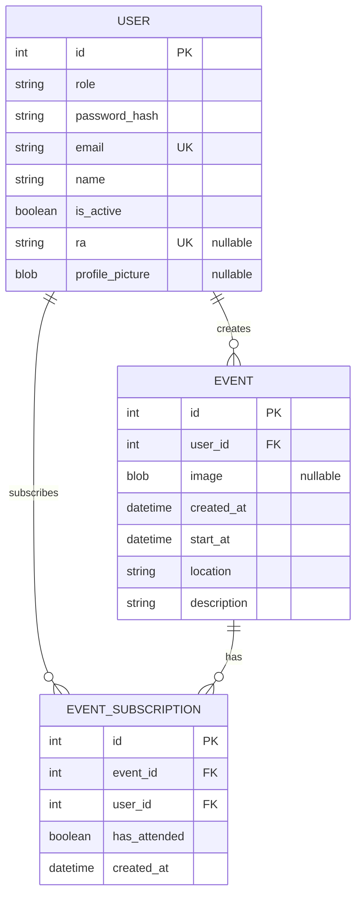

# ERD Proposal

This document proposes the database structure for `User`, `Event`, and `EventSubscription`.

## Assumptions

- Keep the current `users` table semantics already present in the codebase.
- Use `events` and `event_subscriptions` as the new table names.
- Store event images directly in `events.image`, not in a separate table.
- Treat `profile_picture` and `image` as nullable binary fields.
- Keep `users.ra` nullable, but only valid for students.
- Prevent duplicate event subscriptions with a unique constraint on `(event_id, user_id)`.

## Mermaid ERD

## Tables

### `users`

| Column | Type | Constraints |
| --- | --- | --- |
| `id` | `int` | primary key |
| `role` | `str` | not null, expected values: `admin`, `student`, `professor` |
| `password_hash` | `str` | not null |
| `email` | `str` | not null, unique |
| `name` | `str` | not null |
| `is_active` | `bool` | not null, default `true` |
| `ra` | `str` | nullable, unique |
| `profile_picture` | `LargeBinary` | nullable |

Recommended rule:

- `ra` should only be filled when `role = 'student'`.

### `events`

| Column | Type | Constraints |
| --- | --- | --- |
| `id` | `int` | primary key |
| `user_id` | `int` | not null, foreign key -> `users.id` |
| `image` | `LargeBinary` | nullable |
| `created_at` | `datetime` | not null |
| `start_at` | `datetime` | not null |
| `location` | `str` | not null |
| `description` | `str` | not null |

Meaning:

- Each event is created by one user.
- One user can create many events.

### `event_subscriptions`

| Column | Type | Constraints |
| --- | --- | --- |
| `id` | `int` | primary key |
| `event_id` | `int` | not null, foreign key -> `events.id` |
| `user_id` | `int` | not null, foreign key -> `users.id` |
| `has_attended` | `bool` | not null, default `false` |
| `created_at` | `datetime` | not null |

Meaning:

- This table represents the many-to-many relationship between users and events.
- One user can subscribe to many events.
- One event can have many subscribed users.

Recommended rule:

- Add a unique constraint on (`event_id`, `user_id`) to prevent duplicate subscriptions.

## Relationship Summary

- `users.id` 1:N `events.user_id`
- `users.id` 1:N `event_subscriptions.user_id`
- `events.id` 1:N `event_subscriptions.event_id`
- `users` N:M `events` through `event_subscriptions`
